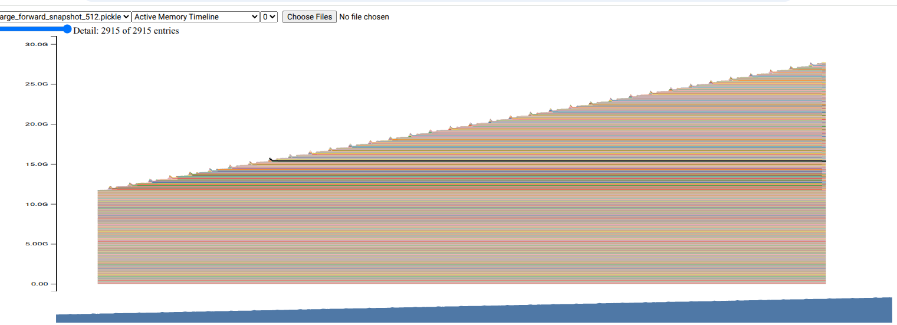
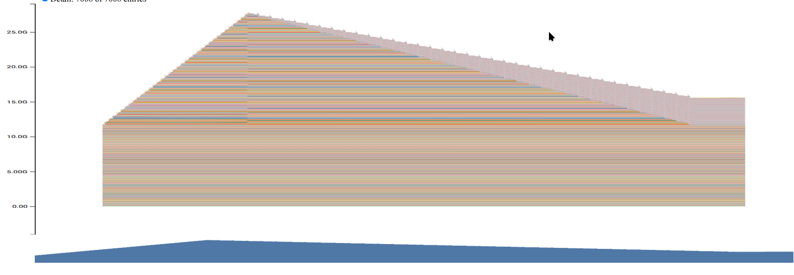

# cs336 Assignment2 Systems

## benchmarking_script
| Model   |   Context |   Forward(ms) |   Backward(ms) |   Step(ms) |   Total(ms) |   CV(%) |
|:--------|----------:|--------------:|---------------:|-----------:|------------:|--------:|
| small   |       128 |        21.008 |         32.322 |      8.268 |      61.598 |   5.861 |
| medium  |       128 |        39.344 |         59.057 |     16.543 |     114.945 |   3.283 |
| large   |       128 |        62.067 |         92.596 |     36.561 |     191.224 |   1.420 |
| xl      |       128 |        99.746 |        120.695 |     90.808 |     311.249 |   0.723 |
| 2.7B    |       128 |       nan     |        nan     |    nan     |     nan     | nan     |

| Model   |   Context |   Forward(ms) |   Backward(ms) |   Step(ms) |   Total(ms) |   CV(%) |
|:--------|----------:|--------------:|---------------:|-----------:|------------:|--------:|
| small   |       256 |        17.009 |         24.925 |      5.977 |      47.911 |   8.394 |
| medium  |       256 |        35.707 |         49.744 |     13.585 |      99.036 |   4.539 |
| large   |       256 |        68.879 |         92.775 |     35.064 |     196.718 |   1.347 |
| xl      |       256 |       120.358 |        163.762 |     89.978 |     374.099 |   4.842 |
| 2.7B    |       256 |       nan     |        nan     |    nan     |     nan     | nan     |

| Model   |   Context |   Forward(ms) |   Backward(ms) |   Step(ms) |   Total(ms) |   CV(%) |
|:--------|----------:|--------------:|---------------:|-----------:|------------:|--------:|
| small   |       512 |        22.067 |         40.793 |      7.183 |      70.043 |   6.094 |
| medium  |       512 |        59.422 |        107.057 |     13.587 |     180.067 |   0.783 |
| large   |       512 |       114.608 |        199.370 |     35.730 |     349.708 |   0.257 |
| xl      |       512 |       nan     |        nan     |    nan     |     nan     | nan     |
| 2.7B    |       512 |       nan     |        nan     |    nan     |     nan     | nan     |

| Model   |   Context |   Forward(ms) |   Backward(ms) |   Step(ms) |   Total(ms) |   CV(%) |
|:--------|----------:|--------------:|---------------:|-----------:|------------:|--------:|
| small   |      1024 |        47.671 |        106.880 |      5.111 |     159.662 |   0.952 |
| medium  |      1024 |       138.719 |        290.854 |      9.994 |     439.567 |   0.095 |
| large   |      1024 |       nan     |        nan     |    nan     |     nan     | nan     |
| xl      |      1024 |       nan     |        nan     |    nan     |     nan     | nan     |
| 2.7B    |      1024 |       nan     |        nan     |    nan     |     nan     | nan     |


change batch size to 2

| Model   |   Context |   Forward(ms) |   Backward(ms) |   Step(ms) |   Total(ms) |   CV(%) |
|:--------|----------:|--------------:|---------------:|-----------:|------------:|--------:|
| small   |       512 |        16.647 |         26.909 |      7.160 |      50.716 |   9.692 |
| medium  |       512 |        44.428 |         65.104 |     10.191 |     119.724 |   2.467 |
| large   |       512 |        80.356 |        119.124 |     35.034 |     234.514 |   0.629 |
| xl      |       512 |       132.934 |        202.117 |     89.213 |     424.263 |   0.718 |
| 2.7B    |       512 |       nan     |        nan     |    nan     |     nan     | nan     |

| Model   |   Context |   Forward(ms) |   Backward(ms) |   Step(ms) |   Total(ms) |   CV(%) |
|:--------|----------:|--------------:|---------------:|-----------:|------------:|--------:|
| small   |      1024 |        27.442 |         57.824 |      5.216 |      90.482 |   2.522 |
| medium  |      1024 |        81.680 |        153.266 |     10.645 |     245.591 |   0.325 |
| large   |      1024 |       150.984 |        289.782 |     36.049 |     476.815 |   0.381 |
| xl      |      1024 |       nan     |        nan     |    nan     |     nan     | nan     |
| 2.7B    |      1024 |       nan     |        nan     |    nan     |     nan     | nan     |

b. no high variability across measurements, but larger model/batch_size has more stable Coefficient of Variation


| Model   |   Context |   Forward(ms) |   Backward(ms) |   Step(ms) |   Total(ms) |   CV(%) |
|:--------|----------:|--------------:|---------------:|-----------:|------------:|--------:|
| small   |       128 |        16.572 |         25.294 |      5.861 |      47.726 |   7.613 |
| medium  |       128 |        31.145 |         48.424 |     12.498 |      92.066 |   5.248 |
| large   |       128 |        56.169 |         72.867 |     35.262 |     164.298 |   2.533 |
| xl      |       128 |        90.623 |        101.603 |     91.539 |     283.765 |   1.319 |
| 2.7B    |       128 |       nan     |        nan     |    nan     |     nan     | nan     |

| Model   |   Context |   Forward(ms) |   Backward(ms) |   Step(ms) |   Total(ms) |   CV(%) |
|:--------|----------:|--------------:|---------------:|-----------:|------------:|--------:|
| small   |       256 |        22.015 |         31.798 |      7.211 |      61.024 |   8.312 |
| medium  |       256 |        40.015 |         60.672 |     13.940 |     114.627 |   4.828 |
| large   |       256 |        68.543 |         93.877 |     36.756 |     199.176 |   1.936 |
| xl      |       256 |       121.884 |        164.609 |     90.563 |     377.055 |   6.395 |
| 2.7B    |       256 |       nan     |        nan     |    nan     |     nan     | nan     |

| Model   |   Context |   Forward(ms) |   Backward(ms) |   Step(ms) |   Total(ms) |   CV(%) |
|:--------|----------:|--------------:|---------------:|-----------:|------------:|--------:|
| small   |       512 |        20.189 |         40.372 |      5.083 |      65.644 |   3.485 |
| medium  |       512 |        62.551 |        106.171 |     10.411 |     179.133 |   0.929 |
| large   |       512 |       114.821 |        198.050 |     35.431 |     348.302 |   0.294 |
| xl      |       512 |       nan     |        nan     |    nan     |     nan     | nan     |
| 2.7B    |       512 |       nan     |        nan     |    nan     |     nan     | nan     |

| Model   |   Context |   Forward(ms) |   Backward(ms) |   Step(ms) |   Total(ms) |   CV(%) |
|:--------|----------:|--------------:|---------------:|-----------:|------------:|--------:|
| small   |      1024 |        45.748 |        107.716 |      7.084 |     160.549 |   0.740 |
| medium  |      1024 |       130.305 |        292.417 |     18.580 |     441.302 |   0.201 |
| large   |      1024 |       nan     |        nan     |    nan     |     nan     | nan     |
| xl      |      1024 |       nan     |        nan     |    nan     |     nan     | nan     |
| 2.7B    |      1024 |       nan     |        nan     |    nan     |     nan     | nan     |

change batch size to 2

| Model   |   Context |   Forward(ms) |   Backward(ms) |   Step(ms) |   Total(ms) |   CV(%) |
|:--------|----------:|--------------:|---------------:|-----------:|------------:|--------:|
| small   |       512 |        15.190 |         32.755 |      5.126 |      53.071 |   4.359 |
| medium  |       512 |        44.592 |         65.183 |     10.382 |     120.157 |   2.733 |
| large   |       512 |        80.480 |        119.242 |     35.353 |     235.076 |   1.021 |
| xl      |       512 |       133.015 |        203.522 |     89.746 |     426.283 |   0.574 |
| 2.7B    |       512 |       nan     |        nan     |    nan     |     nan     | nan     |

| Model   |   Context |   Forward(ms) |   Backward(ms) |   Step(ms) |   Total(ms) |   CV(%) |
|:--------|----------:|--------------:|---------------:|-----------:|------------:|--------:|
| small   |      1024 |        27.042 |         58.940 |      6.031 |      92.013 |   3.070 |
| medium  |      1024 |        82.065 |        154.407 |     10.561 |     247.033 |   0.210 |
| large   |      1024 |       151.293 |        290.324 |     36.172 |     477.789 |   0.482 |
| xl      |      1024 |       nan     |        nan     |    nan     |     nan     | nan     |
| 2.7B    |      1024 |       nan     |        nan     |    nan     |     nan     | nan     |


c. nearly same as with warm up, slightly high CV

## nsys_profile

| Model   |   Context |   Forward(ms) |   Backward(ms) |   Step(ms) |
|:--------|----------:|--------------:|---------------:|-----------:|
| small   |       512 |        30.130 |         48.853 |     17.390 |
| medium  |       512 |        50.162 |         84.061 |     29.585 |
| large   |       512 |       108.094 |        177.765 |     65.187 |
| xl      |       512 |       nan     |        nan     |    nan     |
| 2.7B    |       512 |       nan     |        nan     |    nan     |

a. fairly match with the Python standard library measured results

b. `ampere_bf16_s16816gemm_bf16_128x256_ldg8_f2f_stages_64x3_tn` at 109 instances, not same kernel when both forward and backward passes, it's `elementwise_kernel`

c. `at::native::vectorized_elementwise_kernel`, `at::native::elementwise_kernel` and more other element wise tensor operation

d. the fraction of time spent on matrix multiplication change to 16.5% and `vectorized_elementwise_kernel` operations change to 35%+. element wise operations include: SwiGLU, RMSNorm Scaling, Add, RoPE, Activation Grad, Norm Grad, AdamW update etc.

e. softmax takes 2x times of mutmal in dot self attention. softmax is memory bound, need read/write entire matrix from HBM. FLOPS of mutmal: `2*L^2*d` softmax: `3*L^2*H`, $FLOPS(mutmal)/FLOPS(softmax) = 2d/3H = 2*d_{head}/3$


## mixed_precision_accumulation

save as fp32 and compute with fp16 with acceptable precesion loss, when save/compute are fp16 the calculation error will be 20x larger than save as fp32.


## benchmarking_mixed_precision

a. 
the model parameters within the autocast context: FP32
the output of the first feed-forward layer (ToyModel.fc1): FP16
the output of layer norm (ToyModel.ln): FP32
the model’s predicted logits: FP16
the loss: FP32
and the model’s gradients: FP32

b. same as fp16, bf16 still need to treat layer normalization differently as fp32, the sensitive part of LN is standardization and epsion.

c. train with bf16 save ~35% time, finally get fairly same result


## memory_profiling
**limited by 40GiB GPU memory, use large size model**

a. 



stage1: forward pass calculate and save activations to memory
stage2: backward pass calculate gradients and free activations
stage3: optimizer step don't need new memory, i implemented in-place

b. 
| Model   |   Context |  Memory  |
|:--------|----------:|---------:|
| large   |       512 |   27.9G  |
| large   |       256 |   18.9G  |
| large   |       128 |   15.2G  |

for one training step same as forward pass's peak memory

c.
| Model   |   Context |  Memory  |
|:--------|----------:|---------:|
| large   |       512 |   32.2G  |
| large   |       256 |   19.8G  |
| large   |       128 |   15.8G  |

when context length is long, mixed-precision significantly affect memory usage, bcuz in this case the activation is huge and mixed-precision save this part as bf16.

d. 
| Model   |   Context | residual |
|:--------|----------:|---------:|
| large   |       512 |   10MB   |
| large   |       256 |    5MB   |
| large   |       128 |   2.5MB  |

e.
largest allocate memory is 80MB from scaled_dot_product_attention.


## pytorch_attention
|d_model    | seq_len    | Forward (ms)    | Backward (ms)   | Memory (MB) |
|:----------|-----------:|----------------:|----------------:|------------:|
|16         | 256        | 0.2115          | 0.7100          | 23.14       |
|16         | 1024       | 0.4067          | 1.3922          | 115.81      |
|16         | 4096       | 4.8074          | 15.0105         | 1566.50     |
|16         | 8192       | 18.6628         | 58.4936         | 6188.75     |
|16         | 16384      | OOM             | OOM             | OOM         |
|32         | 256        | 0.2299          | 0.6306          | 24.02       |
|32         | 1024       | 0.3913          | 1.3267          | 119.31      |
|32         | 4096       | 4.9703          | 15.1978         | 1580.50     |
|32         | 8192       | 18.7202         | 58.5669         | 6216.75     |
|32         | 16384      | OOM             | OOM             | OOM         |
|64         | 256        | 0.2247          | 0.5972          | 25.77       |
|64         | 1024       | 0.4022          | 1.3476          | 126.31      |
|64         | 4096       | 5.0355          | 15.3106         | 1608.50     |
|64         | 8192       | 19.0098         | 58.9260         | 6272.75     |
|64         | 16384      | OOM             | OOM             | OOM         |
|128        | 256        | 0.2375          | 0.5643          | 29.27       |
|128        | 1024       | 0.4301          | 1.4106          | 140.31      |
|128        | 4096       | 5.1718          | 15.6606         | 1664.50     |
|128        | 8192       | 19.5993         | 60.1373         | 6384.75     |
|128        | 16384      | OOM             | OOM             | OOM         |

a. at all d_model configurations with 16384 sequence length get OOM

b. 
```
forward and backward memory of scaled_dot_product_attention d_model:128 seq_len 8192
= Parameters + Gradients + Activations
= 2 * (3 * batch_size * context_length * d_model) + 2 * (batch_size * context_length * context_length)
= 4.38 GiB
```

c. in backward, bynamic release the activatons and compute the gradients, the activation is $O(L^2)$ but gradients is $O(L)$

d. 1. FlashAttention 2. Gradients checkpoints 3. ZeRO 4. operator fusion


## torch_compile
a.
|d_model    | seq_len    | Forward (ms)    | Backward (ms)   | Memory (MB) |
|:----------|-----------:|----------------:|----------------:|------------:|
|16         | 256        | 0.1788          | 0.5356          | 21.14       |
|16         | 1024       | 0.2219          | 0.6478          | 83.81       |
|16         | 4096       | 1.7815          | 3.3749          | 1054.50     |
|16         | 8192       | 8.1544          | 18.2337         | 4140.75     |
|16         | 16384      | 31.8973         | 72.5969         | 16457.25    |
|32         | 256        | 0.2278          | 0.6499          | 22.02       |
|32         | 1024       | 0.2523          | 0.6410          | 87.31       |
|32         | 4096       | 2.5957          | 4.8566          | 1068.50     |
|32         | 8192       | 9.8550          | 19.0695         | 4168.75     |
|32         | 16384      | 32.3524         | 75.7464         | 16513.25    |
|64         | 256        | 0.2328          | 0.6402          | 23.77       |
|64         | 1024       | 0.3388          | 0.5769          | 94.31       |
|64         | 4096       | 2.0023          | 3.6305          | 1096.50     |
|64         | 8192       | 7.0231          | 14.9141         | 4224.75     |
|64         | 16384      | OOM             | OOM             | OOM         |
|128        | 256        | 0.2281          | 0.6325          | 27.27       |
|128        | 1024       | 0.3554          | 0.6079          | 108.31      |
|128        | 4096       | 2.1769          | 4.0207          | 1152.50     |
|128        | 8192       | 7.7799          | 16.3734         | 4336.75     |
|128        | 16384      | OOM             | OOM             | OOM         |

b.
| Model      | Mode       | Fwd (ms)   | Bwd (ms)   | Opt (ms)   | Step (ms)  | Mem (MB)   |
|:-----------|:-----------|:-----------|:-----------|:-----------|:-----------|:-----------|
| small      | Vanilla    | 17.34      | 27.41      | 20.80      | 65.56      | 2259.56    |
| small      | Compiled   | 7.69       | 12.74      | 9.83       | 30.25      | 2092.75    |
| medium     | Vanilla    | 35.28      | 51.41      | 30.30      | 116.99     | 6831.00    |
| medium     | Compiled   | 15.72      | 24.38      | 30.93      | 71.03      | 6536.96    |
| large      | Vanilla    | 53.58      | 78.58      | 71.85      | 204.01     | 15218.19   |
| large      | Compiled   | 18.22      | 38.47      | 69.69      | 126.38     | 15063.04   |
| xl         | Vanilla    | 64.80      | 113.84     | 144.63     | 323.27     | 30869.83   |
| xl         | Compiled   | 28.38      | 70.86      | 143.57     | 242.81     | 30900.49   |
| 2.7B       | Vanilla    | OOM        | OOM        | OOM        | OOM        | OOM        |
| 2.7B       | Compiled   | OOM        | OOM        | OOM        | OOM        | OOM        |


## flash benchmarking
| Precision   |   D |     N |   PT Fwd |   PT Bwd |   PT Full |   PT Mem (MB) |   Triton Fwd |   Pure Bwd |   Triton + Pure |   Peak Mem (MB) |
|:------------|----:|------:|---------:|---------:|----------:|--------------:|-------------:|-----------:|----------------:|----------------:|
| bf16        |  16 |   128 |    0.052 |    0.499 |     0.551 |       272.434 |        0.017 |      0.766 |           0.783 |         272.657 |
| bf16        |  16 |   256 |    0.048 |    0.489 |     0.537 |       272.930 |        0.018 |      0.753 |           0.771 |         273.721 |
| bf16        |  16 |   512 |    0.047 |    0.491 |     0.538 |       274.859 |        0.022 |      0.758 |           0.780 |         277.816 |
| bf16        |  16 |  1024 |    0.066 |    0.471 |     0.537 |       282.469 |        0.033 |      0.746 |           0.779 |         293.883 |
| bf16        |  16 |  2048 |    0.163 |    0.356 |     0.519 |       312.688 |        0.054 |      0.739 |           0.793 |         357.516 |
| bf16        |  16 |  4096 |    0.558 |    0.494 |     1.052 |       433.125 |        0.110 |      1.176 |           1.287 |         610.781 |
| bf16        |  16 |  8192 |    2.004 |    1.734 |     3.738 |       914.000 |        0.270 |      4.213 |           4.482 |        1621.312 |
| bf16        |  16 | 16384 |    7.663 |    6.670 |    14.333 |      2835.750 |        0.765 |     16.492 |          17.257 |        5658.375 |
| bf16        |  16 | 32768 |   30.483 |   27.936 |    58.419 |     10519.250 |        2.780 |     65.512 |          68.292 |       21796.500 |
| bf16        |  16 | 65536 |  nan     |  nan     |   nan     |     24600.250 |       10.277 |    nan     |         nan     |       16430.500 |
| bf16        |  32 |   128 |    0.041 |    0.484 |     0.525 |       272.461 |        0.015 |      0.799 |           0.814 |         272.735 |
| bf16        |  32 |   256 |    0.041 |    0.494 |     0.535 |       272.984 |        0.016 |      0.770 |           0.786 |         273.877 |
| bf16        |  32 |   512 |    0.047 |    0.616 |     0.663 |       274.969 |        0.021 |      0.808 |           0.829 |         278.129 |
| bf16        |  32 |  1024 |    0.067 |    0.508 |     0.575 |       282.688 |        0.030 |      0.749 |           0.778 |         294.508 |
| bf16        |  32 |  2048 |    0.163 |    0.346 |     0.509 |       313.125 |        0.048 |      0.742 |           0.790 |         358.766 |
| bf16        |  32 |  4096 |    0.558 |    0.468 |     1.026 |       434.000 |        0.112 |      1.221 |           1.334 |         613.281 |
| bf16        |  32 |  8192 |    2.007 |    1.700 |     3.707 |       915.750 |        0.280 |      4.405 |           4.685 |        1626.312 |
| bf16        |  32 | 16384 |    7.701 |    6.653 |    14.353 |      2839.250 |        0.849 |     17.191 |          18.040 |        5668.375 |
| bf16        |  32 | 32768 |   30.474 |   27.273 |    57.746 |     10526.250 |        3.236 |     68.413 |          71.649 |       21816.500 |
| bf16        |  32 | 65536 |  nan     |  nan     |   nan     |     24608.250 |       12.305 |    nan     |         nan     |       16460.500 |
| bf16        |  64 |   128 |    0.042 |    0.465 |     0.507 |       272.516 |        0.017 |      0.753 |           0.770 |         272.938 |
| bf16        |  64 |   256 |    0.042 |    0.484 |     0.526 |       273.094 |        0.021 |      0.755 |           0.776 |         274.189 |
| bf16        |  64 |   512 |    0.047 |    0.499 |     0.546 |       275.188 |        0.030 |      0.755 |           0.785 |         278.754 |
| bf16        |  64 |  1024 |    0.067 |    0.484 |     0.552 |       283.125 |        0.047 |      0.750 |           0.797 |         295.758 |
| bf16        |  64 |  2048 |    0.165 |    0.349 |     0.514 |       314.000 |        0.084 |      0.726 |           0.810 |         361.266 |
| bf16        |  64 |  4096 |    0.566 |    0.480 |     1.046 |       435.750 |        0.186 |      1.518 |           1.704 |         618.281 |
| bf16        |  64 |  8192 |    2.053 |    1.746 |     3.799 |       919.250 |        0.423 |      5.657 |           6.081 |        1636.312 |
| bf16        |  64 | 16384 |    7.797 |    6.775 |    14.572 |      2846.250 |        1.190 |     21.889 |          23.079 |        5688.375 |
| bf16        |  64 | 32768 |   30.937 |   27.783 |    58.720 |     10540.250 |        4.676 |     86.894 |          91.570 |       21856.500 |
| bf16        |  64 | 65536 |  nan     |  nan     |   nan     |     24624.250 |       17.843 |    nan     |         nan     |       16520.500 |
| bf16        | 128 |   128 |    0.040 |    0.491 |     0.531 |       272.641 |        0.019 |      0.736 |           0.755 |         273.360 |
| bf16        | 128 |   256 |    0.042 |    0.530 |     0.572 |       273.312 |        0.026 |      0.761 |           0.787 |         275.002 |
| bf16        | 128 |   512 |    0.049 |    0.468 |     0.517 |       275.625 |        0.038 |      0.745 |           0.783 |         280.004 |
| bf16        | 128 |  1024 |    0.069 |    0.443 |     0.512 |       284.000 |        0.063 |      0.723 |           0.787 |         298.258 |
| bf16        | 128 |  2048 |    0.171 |    0.361 |     0.532 |       315.750 |        0.113 |      0.679 |           0.792 |         366.266 |
| bf16        | 128 |  4096 |    0.585 |    0.517 |     1.102 |       439.250 |        0.257 |      2.158 |           2.415 |         628.281 |
| bf16        | 128 |  8192 |    2.096 |    1.823 |     3.919 |       926.250 |        0.618 |      7.966 |           8.584 |        1656.312 |
| bf16        | 128 | 16384 |    7.960 |    6.999 |    14.959 |      2860.250 |        2.150 |     31.553 |          33.702 |        5728.375 |
| bf16        | 128 | 32768 |   31.584 |   28.655 |    60.239 |     10568.250 |        8.493 |    122.280 |         130.773 |       21936.500 |
| bf16        | 128 | 65536 |  nan     |  nan     |   nan     |     24656.250 |       31.138 |    nan     |         nan     |       33024.500 |
| fp32        |  16 |   128 |    0.044 |    0.468 |     0.511 |       272.578 |        0.014 |      0.706 |           0.721 |         272.649 |
| fp32        |  16 |   256 |    0.048 |    0.463 |     0.511 |       273.438 |        0.017 |      0.722 |           0.738 |         273.705 |
| fp32        |  16 |   512 |    0.053 |    0.464 |     0.518 |       276.750 |        0.021 |      0.660 |           0.681 |         277.785 |
| fp32        |  16 |  1024 |    0.079 |    0.454 |     0.533 |       289.750 |        0.029 |      0.659 |           0.688 |         293.820 |
| fp32        |  16 |  2048 |    0.210 |    0.320 |     0.530 |       341.250 |        0.046 |      0.658 |           0.704 |         357.391 |
| fp32        |  16 |  4096 |    0.796 |    0.951 |     1.747 |       546.250 |        0.106 |      1.140 |           1.246 |         610.531 |
| fp32        |  16 |  8192 |    2.950 |    3.644 |     6.594 |      1364.250 |        0.259 |      4.175 |           4.434 |        1620.812 |
| fp32        |  16 | 16384 |   11.686 |   14.287 |    25.973 |      4632.250 |        0.758 |     16.449 |          17.207 |        5657.375 |
| fp32        |  16 | 32768 |   51.465 |   57.046 |   108.511 |     17696.250 |        2.828 |     65.853 |          68.681 |       21794.500 |
| fp32        |  16 | 65536 |  nan     |  nan     |   nan     |     32800.250 |       10.656 |    nan     |         nan     |       32804.500 |
| fp32        |  32 |   128 |    0.045 |    0.519 |     0.563 |       272.641 |        0.015 |      0.654 |           0.669 |         272.720 |
| fp32        |  32 |   256 |    0.048 |    0.480 |     0.528 |       273.562 |        0.018 |      0.657 |           0.675 |         273.846 |
| fp32        |  32 |   512 |    0.055 |    0.486 |     0.541 |       277.000 |        0.023 |      0.670 |           0.693 |         278.066 |
| fp32        |  32 |  1024 |    0.082 |    0.462 |     0.544 |       290.250 |        0.033 |      0.666 |           0.698 |         294.383 |
| fp32        |  32 |  2048 |    0.215 |    0.326 |     0.541 |       342.250 |        0.053 |      0.644 |           0.697 |         358.516 |
| fp32        |  32 |  4096 |    0.815 |    0.965 |     1.779 |       548.250 |        0.132 |      1.187 |           1.319 |         612.781 |
| fp32        |  32 |  8192 |    3.051 |    3.614 |     6.666 |      1368.250 |        0.334 |      4.370 |           4.705 |        1625.312 |
| fp32        |  32 | 16384 |   12.040 |   14.852 |    26.892 |      4640.250 |        1.027 |     17.218 |          18.246 |        5666.375 |
| fp32        |  32 | 32768 |   52.964 |   58.898 |   111.863 |     17712.250 |        4.046 |     68.635 |          72.680 |       21812.500 |
| fp32        |  32 | 65536 |  nan     |  nan     |   nan     |     32816.250 |       15.221 |    nan     |         nan     |       16440.500 |
| fp32        |  64 |   128 |    0.047 |    0.464 |     0.511 |       272.766 |        0.019 |      0.659 |           0.678 |         272.892 |
| fp32        |  64 |   256 |    0.049 |    0.478 |     0.527 |       273.812 |        0.024 |      0.659 |           0.684 |         274.127 |
| fp32        |  64 |   512 |    0.059 |    0.483 |     0.542 |       277.500 |        0.035 |      0.712 |           0.747 |         278.629 |
| fp32        |  64 |  1024 |    0.092 |    0.449 |     0.541 |       291.250 |        0.059 |      0.640 |           0.698 |         295.508 |
| fp32        |  64 |  2048 |    0.246 |    0.308 |     0.554 |       344.250 |        0.103 |      0.593 |           0.696 |         360.766 |
| fp32        |  64 |  4096 |    0.920 |    1.203 |     2.123 |       552.250 |        0.235 |      1.483 |           1.718 |         617.281 |
| fp32        |  64 |  8192 |    3.482 |    4.734 |     8.216 |      1376.250 |        0.588 |      5.629 |           6.216 |        1634.312 |
| fp32        |  64 | 16384 |   14.062 |   18.732 |    32.794 |      4656.250 |        2.038 |     21.896 |          23.934 |        5684.375 |
| fp32        |  64 | 32768 |   59.736 |   73.554 |   133.290 |     17744.250 |        8.021 |     87.173 |          95.194 |       21848.500 |
| fp32        |  64 | 65536 |  nan     |  nan     |   nan     |     32848.250 |       29.102 |    nan     |         nan     |       32864.500 |
| fp32        | 128 |   128 |    0.048 |    0.451 |     0.498 |       273.016 |        0.022 |      0.688 |           0.710 |         273.267 |
| fp32        | 128 |   256 |    0.052 |    0.481 |     0.533 |       274.312 |        0.029 |      0.655 |           0.684 |         274.814 |
| fp32        | 128 |   512 |    0.067 |    0.460 |     0.527 |       278.500 |        0.045 |      0.727 |           0.772 |         279.754 |
| fp32        | 128 |  1024 |    0.117 |    0.471 |     0.588 |       293.250 |        0.077 |      0.627 |           0.704 |         297.758 |
| fp32        | 128 |  2048 |    0.302 |    0.464 |     0.766 |       348.250 |        0.138 |      0.620 |           0.758 |         365.266 |
| fp32        | 128 |  4096 |    1.155 |    1.732 |     2.888 |       560.250 |        0.500 |      2.119 |           2.619 |         626.281 |
| fp32        | 128 |  8192 |    4.425 |    6.533 |    10.958 |      1392.250 |        1.451 |      7.915 |           9.366 |        1652.312 |
| fp32        | 128 | 16384 |   17.798 |   26.151 |    43.949 |      4688.250 |        4.822 |     31.589 |          36.411 |        5720.375 |
| fp32        | 128 | 32768 |   74.550 |  102.245 |   176.796 |     17808.250 |       19.511 |    123.823 |         143.334 |       21920.500 |
| fp32        | 128 | 65536 |  nan     |  nan     |   nan     |     32912.250 |       74.395 |    nan     |         nan     |       32944.500 |


## distributed_communication_single_node

| Backend | Processes | Size (MB) | Avg Time (s) | Bandwidth (GB/s) |
|---------|-----------|-----------|--------------|------------------|
|    GLOO |         2 |         1 |     0.000665 |             1.47 |
|    GLOO |         2 |        10 |     0.006661 |             1.47 |
|    GLOO |         2 |       100 |     0.066947 |             1.46 |
|    GLOO |         2 |      1000 |     0.554199 |             1.76 |
|    GLOO |         4 |         1 |     0.002043 |             0.72 |
|    GLOO |         4 |        10 |     0.011817 |             1.24 |
|    GLOO |         4 |       100 |     0.095560 |             1.53 |
|    GLOO |         4 |      1000 |     1.197219 |             1.22 |
|    GLOO |         6 |         1 |     0.002711 |             0.60 |
|    GLOO |         6 |        10 |     0.010447 |             1.56 |
|    GLOO |         6 |       100 |     0.099437 |             1.64 |
|    GLOO |         6 |      1000 |     1.212578 |             1.34 |

| Backend | Procs | Size (MB) | Avg Time (s) | Max Time (s) | Bandwidth (GB/s) |
| :------ | :---- | :-------- | :----------- | :----------- | :--------------- |
| RCCL    |  2    |        1  |     0.000260 |   0.000261   |     3.75         |
| RCCL    |  2    |       10  |     0.002087 |   0.002088   |     4.68         |
| RCCL    |  2    |      100  |     0.020609 |   0.020618   |     4.74         |
| RCCL    |  2    |     1000  |     0.218816 |   0.218816   |     4.46         |
| RCCL    |  4    |        1  |     0.000422 |   0.000423   |     3.47         |
| RCCL    |  4    |       10  |     0.003767 |   0.003768   |     3.89         |
| RCCL    |  4    |      100  |     0.037171 |   0.037188   |     3.94         |
| RCCL    |  4    |     1000  |     0.364747 |   0.364757   |     4.02         |

| Backend | Procs | Size (MB) | Avg Time (s) | Max Time (s) | Bandwidth (GB/s) |
| :---    |  :--- | :---      | :---         | :---         | :---             |
| HCCL    |  2    | 1         | 0.000346     | 0.000361     | 2.82             |
| HCCL    |  2    | 10        | 0.000846     | 0.000847     | 11.54            |
| HCCL    |  2    | 100       | 0.007151     | 0.007152     | 13.66            |
| HCCL    |  2    | 1000      | 0.070321     | 0.070335     | 13.89            |
| HCCL    |  2    | 10000     | 0.702112     | 0.702126     | 13.91            |
| HCCL    |  2    | 50000     | 3.509999     | 3.510002     | 13.91            |
| HCCL    |  4    | 1         | 0.000560     | 0.000572     | 2.62             |
| HCCL    |  4    | 10        | 0.001215     | 0.001223     | 12.06            |
| HCCL    |  4    | 100       | 0.010752     | 0.010768     | 13.62            |
| HCCL    |  4    | 1000      | 0.104147     | 0.104168     | 14.07            |
| HCCL    |  4    | 10000     | 1.040042     | 1.040052     | 14.08            |
| HCCL    |  4    | 50000     | 5.201993     | 5.202002     | 14.08            |

fi   rst   i test free 4*dcu on scnet, significantly lower than expected, possibly because the dcu(s) is in a cross-node state.

## naive_ddp_benchmarking

bcuz without multi-gpu, i use gloo backend, the all-reduce is transfer in: GPU <- gloo -> CPU

| Step | Total  | Fwd    | Bwd    | Comm (All-Reduce) | Opt    |
| :--- | :----- | :---   | :---   | :---              | :---   |
|   0  | 4.079s | 0.396s | 0.427s |    3.047s (74.7%) | 0.210s |
|   0  | 4.142s | 0.411s | 0.448s |    3.065s (74.0%) | 0.218s |
|   1  | 3.697s | 0.156s | 0.352s |    3.029s (81.9%) | 0.159s |
|   1  | 3.706s | 0.157s | 0.355s |    3.034s (81.9%) | 0.160s |
|   2  | 3.710s | 0.158s | 0.357s |    3.033s (81.7%) | 0.162s |
|   2  | 3.712s | 0.157s | 0.358s |    3.034s (81.8%) | 0.163s |
|   3  | 3.718s | 0.169s | 0.357s |    3.032s (81.5%) | 0.161s |
|   3  | 3.718s | 0.168s | 0.354s |    3.034s (81.6%) | 0.161s |
|   4  | 3.719s | 0.158s | 0.355s |    3.044s (81.9%) | 0.162s |
|   4  | 3.719s | 0.155s | 0.354s |    3.047s (81.9%) | 0.163s |
|   5  | 3.606s | 0.171s | 0.355s |    2.917s (80.9%) | 0.162s |
|   5  | 3.608s | 0.170s | 0.357s |    2.917s (80.8%) | 0.163s |
|   6  | 3.633s | 0.174s | 0.355s |    2.942s (81.0%) | 0.162s |
|   6  | 3.633s | 0.175s | 0.356s |    2.939s (80.9%) | 0.163s |
|   7  | 3.664s | 0.172s | 0.355s |    2.974s (81.2%) | 0.162s |
|   7  | 3.667s | 0.171s | 0.354s |    2.978s (81.2%) | 0.163s |
|   8  | 3.682s | 0.164s | 0.353s |    3.006s (81.6%) | 0.160s |
|   8  | 3.684s | 0.165s | 0.355s |    3.003s (81.5%) | 0.160s |
|   9  | 3.695s | 0.155s | 0.357s |    3.021s (81.8%) | 0.161s |
|   9  | 3.695s | 0.157s | 0.357s |    3.020s (81.7%) | 0.162s |

on 4*910B3 with pcie connect, result is in line with expectations

```
Step  0 | Total: 1.598s | Fwd/Bwd: 0.809s | Comm (All-Reduce): 0.041s (2.6%) | Opt: 0.748s
Step  0 | Total: 2.852s | Fwd/Bwd: 1.057s | Comm (All-Reduce): 0.052s (1.8%) | Opt: 1.743s
Step  1 | Total: 1.144s | Fwd/Bwd: 0.344s | Comm (All-Reduce): 0.054s (4.7%) | Opt: 0.747s
Step  1 | Total: 1.149s | Fwd/Bwd: 0.528s | Comm (All-Reduce): 0.048s (4.2%) | Opt: 0.573s
Step  2 | Total: 1.113s | Fwd/Bwd: 0.500s | Comm (All-Reduce): 0.042s (3.7%) | Opt: 0.571s
Step  2 | Total: 1.210s | Fwd/Bwd: 0.379s | Comm (All-Reduce): 0.042s (3.5%) | Opt: 0.788s
Step  3 | Total: 1.417s | Fwd/Bwd: 0.387s | Comm (All-Reduce): 0.055s (3.9%) | Opt: 0.975s
Step  3 | Total: 1.444s | Fwd/Bwd: 0.818s | Comm (All-Reduce): 0.042s (2.9%) | Opt: 0.584s
Step  4 | Total: 1.097s | Fwd/Bwd: 0.480s | Comm (All-Reduce): 0.041s (3.7%) | Opt: 0.576s
Step  4 | Total: 1.124s | Fwd/Bwd: 0.356s | Comm (All-Reduce): 0.042s (3.8%) | Opt: 0.726s
Step  5 | Total: 1.214s | Fwd/Bwd: 0.591s | Comm (All-Reduce): 0.043s (3.6%) | Opt: 0.580s
Step  5 | Total: 1.231s | Fwd/Bwd: 0.362s | Comm (All-Reduce): 0.042s (3.4%) | Opt: 0.827s
Step  6 | Total: 1.042s | Fwd/Bwd: 0.422s | Comm (All-Reduce): 0.057s (5.5%) | Opt: 0.563s
Step  6 | Total: 1.035s | Fwd/Bwd: 0.361s | Comm (All-Reduce): 0.050s (4.8%) | Opt: 0.624s
Step  7 | Total: 1.117s | Fwd/Bwd: 0.499s | Comm (All-Reduce): 0.051s (4.6%) | Opt: 0.567s
Step  7 | Total: 1.136s | Fwd/Bwd: 0.383s | Comm (All-Reduce): 0.052s (4.6%) | Opt: 0.701s
Step  8 | Total: 1.025s | Fwd/Bwd: 0.412s | Comm (All-Reduce): 0.041s (4.0%) | Opt: 0.571s
Step  8 | Total: 1.114s | Fwd/Bwd: 0.350s | Comm (All-Reduce): 0.053s (4.8%) | Opt: 0.711s
Step  9 | Total: 0.978s | Fwd/Bwd: 0.361s | Comm (All-Reduce): 0.044s (4.5%) | Opt: 0.572s
Step  9 | Total: 1.026s | Fwd/Bwd: 0.343s | Comm (All-Reduce): 0.044s (4.3%) | Opt: 0.638s
Step 10 | Total: 1.103s | Fwd/Bwd: 0.487s | Comm (All-Reduce): 0.048s (4.4%) | Opt: 0.568s
Step 10 | Total: 1.140s | Fwd/Bwd: 0.377s | Comm (All-Reduce): 0.040s (3.5%) | Opt: 0.722s
Step 11 | Total: 1.124s | Fwd/Bwd: 0.397s | Comm (All-Reduce): 0.053s (4.7%) | Opt: 0.674s
Step 11 | Total: 1.130s | Fwd/Bwd: 0.508s | Comm (All-Reduce): 0.049s (4.3%) | Opt: 0.574s
Step 12 | Total: 1.161s | Fwd/Bwd: 0.545s | Comm (All-Reduce): 0.043s (3.7%) | Opt: 0.573s
Step 12 | Total: 1.164s | Fwd/Bwd: 0.328s | Comm (All-Reduce): 0.040s (3.4%) | Opt: 0.795s
Step 13 | Total: 1.166s | Fwd/Bwd: 0.352s | Comm (All-Reduce): 0.043s (3.7%) | Opt: 0.770s
Step 13 | Total: 1.169s | Fwd/Bwd: 0.549s | Comm (All-Reduce): 0.040s (3.5%) | Opt: 0.580s
Step 14 | Total: 1.310s | Fwd/Bwd: 0.697s | Comm (All-Reduce): 0.040s (3.1%) | Opt: 0.573s
Step 14 | Total: 1.317s | Fwd/Bwd: 0.359s | Comm (All-Reduce): 0.044s (3.3%) | Opt: 0.915s


Step  0 | Total: 2.785s | Fwd/Bwd: 0.882s | Comm (All-Reduce): 0.048s (1.7%) | Opt: 1.855s
Step  0 | Total: 1.690s | Fwd/Bwd: 0.840s | Comm (All-Reduce): 0.035s (2.1%) | Opt: 0.814s
Step  1 | Total: 1.064s | Fwd/Bwd: 0.394s | Comm (All-Reduce): 0.029s (2.7%) | Opt: 0.641s
Step  1 | Total: 1.155s | Fwd/Bwd: 0.457s | Comm (All-Reduce): 0.026s (2.2%) | Opt: 0.671s
Step  2 | Total: 1.163s | Fwd/Bwd: 0.346s | Comm (All-Reduce): 0.022s (1.9%) | Opt: 0.795s
Step  2 | Total: 1.166s | Fwd/Bwd: 0.504s | Comm (All-Reduce): 0.013s (1.1%) | Opt: 0.649s
Step  3 | Total: 1.287s | Fwd/Bwd: 0.628s | Comm (All-Reduce): 0.017s (1.3%) | Opt: 0.642s
Step  3 | Total: 1.290s | Fwd/Bwd: 0.422s | Comm (All-Reduce): 0.011s (0.9%) | Opt: 0.856s
Step  4 | Total: 1.065s | Fwd/Bwd: 0.343s | Comm (All-Reduce): 0.011s (1.1%) | Opt: 0.711s
Step  4 | Total: 1.174s | Fwd/Bwd: 0.402s | Comm (All-Reduce): 0.012s (1.0%) | Opt: 0.761s
Step  5 | Total: 1.038s | Fwd/Bwd: 0.385s | Comm (All-Reduce): 0.012s (1.1%) | Opt: 0.641s
Step  5 | Total: 1.108s | Fwd/Bwd: 0.377s | Comm (All-Reduce): 0.012s (1.1%) | Opt: 0.718s
Step  6 | Total: 1.167s | Fwd/Bwd: 0.376s | Comm (All-Reduce): 0.012s (1.1%) | Opt: 0.779s
Step  6 | Total: 1.201s | Fwd/Bwd: 0.539s | Comm (All-Reduce): 0.012s (1.0%) | Opt: 0.650s
Step  7 | Total: 1.063s | Fwd/Bwd: 0.410s | Comm (All-Reduce): 0.011s (1.0%) | Opt: 0.641s
Step  7 | Total: 1.107s | Fwd/Bwd: 0.350s | Comm (All-Reduce): 0.011s (1.0%) | Opt: 0.746s
Step  8 | Total: 1.061s | Fwd/Bwd: 0.407s | Comm (All-Reduce): 0.012s (1.1%) | Opt: 0.641s
Step  8 | Total: 1.043s | Fwd/Bwd: 0.352s | Comm (All-Reduce): 0.011s (1.1%) | Opt: 0.681s
Step  9 | Total: 1.189s | Fwd/Bwd: 0.405s | Comm (All-Reduce): 0.011s (1.0%) | Opt: 0.773s
Step  9 | Total: 1.190s | Fwd/Bwd: 0.536s | Comm (All-Reduce): 0.011s (0.9%) | Opt: 0.643s
Step 10 | Total: 1.047s | Fwd/Bwd: 0.340s | Comm (All-Reduce): 0.011s (1.1%) | Opt: 0.696s
Step 10 | Total: 1.057s | Fwd/Bwd: 0.398s | Comm (All-Reduce): 0.012s (1.1%) | Opt: 0.647s
Step 11 | Total: 1.037s | Fwd/Bwd: 0.383s | Comm (All-Reduce): 0.013s (1.3%) | Opt: 0.641s
Step 11 | Total: 1.040s | Fwd/Bwd: 0.348s | Comm (All-Reduce): 0.011s (1.1%) | Opt: 0.680s
Step 12 | Total: 1.127s | Fwd/Bwd: 0.471s | Comm (All-Reduce): 0.017s (1.5%) | Opt: 0.639s
Step 12 | Total: 1.128s | Fwd/Bwd: 0.384s | Comm (All-Reduce): 0.012s (1.1%) | Opt: 0.731s
Step 13 | Total: 1.064s | Fwd/Bwd: 0.414s | Comm (All-Reduce): 0.012s (1.2%) | Opt: 0.638s
Step 13 | Total: 1.042s | Fwd/Bwd: 0.345s | Comm (All-Reduce): 0.014s (1.3%) | Opt: 0.683s
Step 14 | Total: 1.038s | Fwd/Bwd: 0.336s | Comm (All-Reduce): 0.013s (1.3%) | Opt: 0.689s
Step 14 | Total: 1.044s | Fwd/Bwd: 0.382s | Comm (All-Reduce): 0.014s (1.3%) | Opt: 0.649s
```

## minimal_ddp_flat_benchmarking

### Benchmark Results
| Method | Avg Step Time (s) |
| :--- | :--- |
| Naive DDP (per-parameter all-reduce) | 1.2199 |
| Flat DDP (single flattened all-reduce) | 1.3792 |

**Analysis**:
In this run, the flattened single all-reduce is slower than per-parameter all-reduce. This can happen when the flatten/unflatten overhead and the larger single collective delay reduce overlap opportunities, especially if the comm backend is not saturating bandwidth or if CPU-side overhead dominates.

## ddp_overlap_individual_parameters_benchmarking

### (a) Benchmark Results
| Method | Avg Step Time (s) |
| :--- | :--- |
| **Individual Overlap** | **0.99s** |
| Naive DDP | 1.22s |
| Flat DDP | 1.38s |

**Analysis**:
The Individual Overlap implementation (0.99s) significantly outperforms both Naive (1.22s) and Flat (1.38s) approaches. By overlapping communication with backward computation, we successfully hide the latency of gradient synchronization. Flat DDP performs worst as it serializes all communication after computation.

## ddp_bucketed_benchmarking

### (a) Bucket Size Benchmark
| Bucket Size | Avg Step Time (s) |
| :--- | :--- |
| 1 MB | 1.02s |
| 10 MB | 1.00s |
| **100 MB** | **0.94s (Best)** |
| 1000 MB | 0.99s |

**Analysis**:
Performance follows a trade-off curve:
*   **Small buckets (1MB)** incur high CPU overhead and kernel launch latency due to frequent communication calls.
*   **Large buckets (1000MB)** delay the start of communication (high startup latency), reducing the overlap window.
*   **100MB** offers the best trade-off between overhead and latency.

### (b) Optimal Bucket Size
Let:
* `S`: total parameter size (bytes)
* `w`: all-reduce bandwidth (bytes/s)
* `o`: per-call overhead (s)
* `n_b`: number of buckets
* `C`: effective compute throughput (bytes/s) for gradient production

Assuming the time to compute a bucket equals the time to communicate it, a simple overhead model is:

```
Overhead(n_b) ≈ S / (n_b * C) + S / (n_b * w) + n_b * o
```

Let `B = S / n_b` be bucket size. Then:

```
Overhead(B) ≈ B / C + S * o / B + B / w
```

Setting derivative to zero yields:

```
B_opt = sqrt( S * o / (1/C + 1/w) )
```

If `C >> w`, this simplifies to `B_opt ≈ sqrt(S * o * w)`.


## communication_accounting

### (a) Single Device Memory
For the XL/XXL model (`d_model=16384`, `d_ff=53248`, `num_blocks=126`):
* **Total parameters**: ~220B.
* **FP32 static memory** (master weights + grads + AdamW states): 16 bytes/param → ~3.52 TB.
* **H100 equivalent**: 3.52 TB / 80 GB ≈ 44 H100 GPUs.

### (b) NFSDP Sharding
Static state per device is ~`3.52 TB / N`. To fit under 95 GB, we need `N ≥ 38` (ignoring activations). If we also shard half the activations, this reduces peak memory but the static-state lower bound still requires ~38 shards.

### (c) Compute vs Communication Bound
* **Condition**: forward compute time ≥ FSDP weight-gather time + TP activation reduction time.
* **Result**: per-device batch size ≈ **2799** to be compute bound.
* **Global batch** (DP=16): ≈ 2799 × 16 ≈ **44780**.

### (d) Reducing Batch Size
Techniques to reduce the critical batch size:
1.  **Gradient Accumulation**: Simulate large batches with micro-batches.
2.  **Activation Checkpointing**: Trade compute for memory to enable larger physical batches.
3.  **Operator Fusion**: Reduce HBM access overhead.
4.  **Communication Overlap**: Hide FSDP communication behind compute (prefetching).
5.  **Quantized Communication (FP8)**: Halve communication volume, reducing {comm}$.


## optimizer_state_sharding_accounting

### (a) Peak Memory Usage (XL, 1 node × 2 GPUs)
I measured peak memory at three points: after model/optimizer init, right before `optimizer.step()`, and right after `optimizer.step()`.  
Use `cs336_systems/ddp/optimizer_state_sharding_benchmarking.py` with the standard config to reproduce.

**Baseline (no sharding):**
* Init: `7604.70 MB` (alloc), `7604.70 MB` (peak)
* Pre-step: `30238.77 MB` (alloc), `30355.96 MB` (peak)
* Post-step: `30238.77 MB` (alloc), `30355.96 MB` (peak)

**Sharded optimizer:**
* Init: `7604.70 MB` (alloc), `7604.70 MB` (peak)
* Pre-step: `22777.17 MB` (alloc), `22918.36 MB` (peak)
* Post-step: `22777.17 MB` (alloc), `22918.36 MB` (peak)

**Breakdown (expected):**
The sharded optimizer reduces optimizer state memory to ~1/world_size per rank, while parameters and gradients remain replicated. Thus, steady-state allocation drops mainly from optimizer states; activation memory is unchanged. To keep peak low, we synchronize via **per-parameter broadcast** (no flatten buffer), so transient peak stays close to steady state.

### (b) Training Speed
Using the same setup, average step time:
* Baseline (no sharding): `0.499740 s/step`
* Sharded optimizer: `0.626323 s/step`

In practice, sharding adds a broadcast phase after `optimizer.step()`, so step time can increase slightly even though memory drops.

### (c) Difference vs ZeRO-1
This implementation shards only optimizer state and then **broadcasts updated parameters** each step. ZeRO-1 also shards optimizer state, but typically uses **all-gather / reduce-scatter** patterns integrated with DDP to reduce redundant communication and avoid a full broadcast of parameters each step. ZeRO-1 is usually more communication-efficient at scale.
